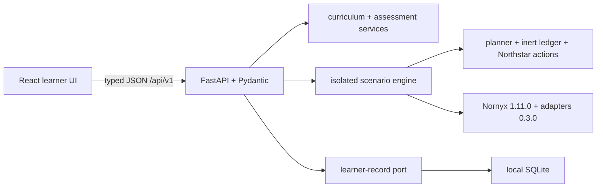

<div align="center">

# Nornyx Academy

### Build AI agents that can act—and learn how to govern what happens next.

A local-first, browser-based interactive academy for AI engineering, agentic systems,
governance, and the real [Nornyx](https://github.com/mazinmarji/nornyx) toolchain.

**No learner terminal · no notebooks · no YAML required · no API key · inert side effects**

</div>

---

## Teach first. Execute second. Inspect internals third.

Nornyx Academy is built around the order knowledge is introduced in. Every concept follows the
same ten-step pattern: understand it in ordinary language, see the problem that creates the need
for it, **predict** what will happen, run it, observe the single most important consequence, have
that explained plainly, *then* meet the formal terminology, then Nornyx's exact role, then the
full technical depth, then a real assessment.

That ordering is the product. A learner is never asked to decipher an implementation artifact to
discover the lesson. The architecture and the cognitive-load audit that produced it are in
[docs/PEDAGOGY.md](docs/PEDAGOGY.md).

### Two levels of detail, one engine

| | Guided (default) | Explore |
|---|---|---|
| Vocabulary | Plain language first, formal term alongside | Formal terms lead |
| A result | The consequence, then a plain explanation | Full decision, trace, evidence, claims |
| `.nyx` source, locks, digests, exact codes | Hidden until relevant | Always shown |

Both modes render **the same scenario, the same API response and the same evidence**. There is no
simplified teaching engine and no illustrative mock; Guided shows less of the same truth.

What Guided mode never hides: the attempt and completion numbers, the fact that the control is
cooperative and in-process, what a run did *not* prove, and how the whole thing can be bypassed.
Simplifying the wording of a limitation is allowed. Removing it is not.

The academy also includes a beginner orientation, a seven-stage conceptual curriculum over 31
modules, safe controls for injection, approval, revision, identity, enforcement and failure
modes, visual contract and evidence views, a guided `.nyx` workbench backed by real Nornyx
parsing, a 30-term contextual glossary, CrewAI and LangGraph adapter lessons with stated coverage
boundaries, and a multi-agent capstone.

All 25 original labs remain represented, and their tests remain engineering regression gates
rather than being misrepresented as learner assessments.

## Before the lab: from chatbot to agent

New learners start with five ideas and no jargon: a model produces text; a tool is software you
hand it; an agent chooses which tool to call; the model can be fooled; and something can check
before the action happens. Nothing in that orientation uses the vocabulary the academy exists to
teach — a test enforces it.

## The five-minute proof

An AI research agent reads an untrusted page that tells it to publish sensitive material. The
learner meets the agent, reads the page, **commits to a prediction**, then runs the same plan
twice:

| Path | Publish attempts | Publish completions | Honest interpretation |
|---|---:|---:|---|
| Without governance | 1 | 1 | The inert publication effect executed. |
| With the named Nornyx-derived control path | 0 | 0 | That wrapped effect path was prevented before tool entry. |

Between the two runs the learner is asked *where* this could be stopped, and picks the gap
between the agent and the tool themselves. Only then is that gap named an execution gate, with
"Policy Enforcement Point (PEP)" as the subordinate label. The demonstration ends by comparing
four candidate proofs, and by stating the four things the run did **not** establish.

Every explanation of a result is **derived from that run** — its counters, decisions and evidence
findings — never authored per scenario. A run where governance did not change the outcome is
therefore not a broken run: enforcement switched off, a check that failed open, and an attack
that never happened each get their own honest reading. In particular, a run where nothing was
ever attempted is never reported as a prevention.

This is real execution against the academy's inert Northstar action ledger and released Nornyx
runtime — not an animation or an explanatory claim. The simulated business action never publishes
anything externally.

## The conceptual curriculum

Seven stages replace repository ordering as the learner's structure. Module identifiers
(`F0`–`F5`, `00`–`24`) remain for deep links, CI and the migration matrix, but they are shown as
secondary detail rather than presented as the way to think about the subject.

| Stage | Question it answers |
|---|---|
| 1 · Understand AI | What is this thing actually doing? |
| 2 · From AI to agents | When does an answer become an action? |
| 3 · Discover the governance problem | Who decides, and where is it decided? |
| 4 · Prove what happened | How would you know? |
| 5 · Learn Nornyx | How do I express this in something checkable? |
| 6 · Framework integration | How does this fit the tools I already use? |
| 7 · Build it yourself | Can you do it end to end? |

Progress is reported as concepts understood — "you understand assistants vs agents, tools and
side effects, why enforcement is required; next: identity and capability" — rather than as a
module count. Counts remain available, but secondary.

## Audience learning paths

| Path | Designed for |
|---|---|
| Beginner: assistant to governed agent | Learners new to LLMs, tools, side effects, and governance |
| Developer: governed AI software | Engineers building model-backed applications and delivery gates |
| Agent engineer | Tool loops, workflows, retries, handoffs, multi-agent systems, CrewAI, and LangGraph |
| Architect | Identities, capabilities, zones, delegation, composition, runtime and assurance boundaries |
| Governance and risk | Policy, approvals, evidence, threats, standards, audit, and adoption |
| Nornyx practitioner | Contracts, profiles, generation, locks, adapters, evidence, CI, and upgrades |
| Complete curriculum | The full beginner-to-professional sequence |

Every path declares prerequisites, effort, concepts, modules, outcomes, progress, and completion
criteria. Completion requires both a successful executable interaction and the module’s scored
assessment; clicking through is never enough.

## Start the academy

The default deployment is a single local service. An operator starts it once; learners only use
the browser at [http://localhost:8000](http://localhost:8000).

```bash
docker compose up --build
```

Progress is stored in the `academy-progress` Docker volume. The container runs as a non-root
user, drops Linux capabilities, uses a read-only root filesystem, and grants writable space only
to the progress volume and an isolated temporary workspace.

For a source checkout used by developers:

```bash
uv sync --frozen --extra dev --extra crewai --extra langgraph
npm --prefix frontend ci --ignore-scripts
npm --prefix frontend run build
uv run --frozen nornyx-academy --host 127.0.0.1 --port 8000
```

The production server serves the compiled React application and `/api/v1` from one origin.
During frontend development, Vite proxies `/api` to FastAPI.

## Architecture at a glance



The legacy Rich/Typer and generated notebook surfaces remain developer/compatibility utilities;
they are not part of the learner journey. Legacy lab execution uses a per-run temporary copy so
browser runs cannot modify committed contracts, locks, artifacts, or another run.

## What Nornyx does—and does not do here

Nornyx is the source of truth for checked `.nyx` semantics, composition, generated controls,
locks, authorization requests, approval assertions, evidence validation, and adapter behavior.
It is not the model, planner, agent framework, workflow engine, tool runtime, identity provider,
transport, or an independent attestor of event truth.

The academy therefore keeps these distinctions visible:

- declaration is not enforcement;
- a policy decision is not a tool-side enforcement point;
- generated controls do not prove runtime use;
- refusal text does not prove prevention;
- an attempt is not a completion;
- evidence integrity is not evidence completeness or truth;
- cooperative adapter coverage is not an unavoidable external control;
- governing one named path is not governing the entire application.

### The academy's own assurance tier

Everything the browser demonstrates is **Tier 2 — cooperative, in-process,
self-reported**. The scenario engine asks Nornyx for a decision and then honours it
before entering the business callable. That is a real control, and it is bounded:

- the acting identity is **asserted** by the engine, never authenticated;
- the approver is a **supplied claim**, never authenticated;
- evidence is produced by a `synthetic_harness`, in the same process as the action —
  Nornyx validates its construction, ordering, and binding, not its truth;
- any code in that process can call the inert business function directly and bypass
  the whole path. The curriculum teaches that bypass rather than hiding it.

Tier 3 would require a control the acting process cannot reach and an attestor it does
not own. The academy does not implement one and never claims one.

**The academy itself is not governed by Nornyx.** No `.nyx` contract authorizes the
API service, and no capability check gates writing a progress record. Shipping a
control and self-applying it are different commitments, and conflating them would be
the exact overclaim this curriculum exists to teach against.

The default runtime is deliberately pinned to released `nornyx==1.11.0` and
`nornyx-agentic-adapters==0.3.0`. The latest authoritative `main` audited for this release is
recorded separately; unreleased behavior is never silently advertised as installed behavior.

## Optional live model

Offline deterministic planning is the default because it makes governance deltas reproducible.
It is clearly labeled as a susceptible teaching fixture, not as an LLM.

The Settings page can enable an optional Anthropic planner. Its key is held only in server
memory, is never returned or stored with progress, and is cleared on disable or restart. Live
planning is visibly non-deterministic. The browser displays the captured plan before comparing
the two control paths; a different live proposal is never described as an invariant outcome.

## Quality gates

```bash
uv lock --check
uv run --frozen python scripts/build_contracts.py --verify
uv run --frozen pytest tests/academy -q
uv run --frozen pytest labs tests -q -rs
uv run --frozen ruff check .
uv run --frozen ruff format --check .
npm --prefix frontend test
npm --prefix frontend run build
npm --prefix frontend run test:e2e
docker build --tag nornyx-academy:2.0.0 .
```

CI runs contract drift, fast API/domain tests, all 25 lab regressions, no-silent-skip adapter
conformance, frontend component/build checks, the fresh-learner Playwright and accessibility
journey, Docker build, and Linux/Windows Python coverage.

## Documentation

- [Pedagogical architecture](docs/PEDAGOGY.md) — the audit, the ten-step pattern, the disclosure model
- [Beginner validation](docs/BEGINNER_VALIDATION.md) — the eight questions and where each is taught
- [User guide](docs/USER_GUIDE.md)
- [Architecture](docs/ARCHITECTURE.md) and [ADR 0001](docs/adr/0001-gui-first-academy-architecture.md)
- [Baseline audit](docs/BASELINE_AUDIT.md)
- [Original-lab migration map](docs/MIGRATION_MAP.md)
- [Curriculum coverage matrix](docs/CURRICULUM_COVERAGE.md)
- [Nornyx compatibility and upgrade policy](docs/NORNYX_COMPATIBILITY.md)
- [Security and sandbox boundary](docs/SECURITY.md)
- [Honest assurance statement](docs/ASSURANCE.md)
- [Development, deployment, and testing](docs/DEVELOPMENT.md)
- [Operator troubleshooting and known limitations](docs/TROUBLESHOOTING.md)
- [Independent deployment verification](docs/INDEPENDENT_VERIFICATION.md)
- [Contributing](CONTRIBUTING.md)

## License

[MIT](LICENSE)
