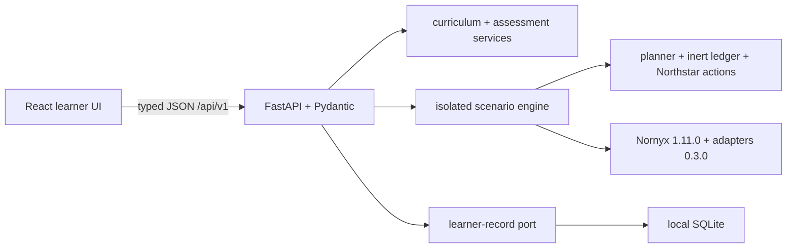

<div align="center">

# Nornyx Academy

### Build AI agents that can act—and learn how to govern what happens next.

A local-first, browser-based interactive academy for AI engineering, agentic systems,
governance, and the real [Nornyx](https://github.com/mazinmarji/nornyx) toolchain.

**No learner terminal · no notebooks · no YAML required · no API key · inert side effects**

</div>

---

## A training product, not a terminal wrapper

Nornyx Academy lets a learner understand, configure, run, break, compare, validate, assess,
and complete the curriculum entirely in a graphical interface. The browser calls versioned,
schema-validated APIs; the service invokes domain-level Python and Nornyx APIs. It never spawns
the old CLI and scrapes its output.

The academy includes:

- an orientation experience for complete beginners;
- seven audience-aware learning paths and 31 modules;
- a one-click governed-versus-ungoverned demonstration;
- safe controls for injection, approval, revision, identity, enforcement, and failure modes;
- visual contract, identity, capability, trust-zone, approval, and evidence views;
- a guided `.nyx` workbench backed by real Nornyx parsing and diagnostics;
- meaningful assessments and persistent local progress;
- CrewAI and LangGraph adapter lessons with explicit availability and coverage boundaries;
- a configurable multi-agent governance capstone;
- responsive, keyboard-accessible browser UI with deterministic offline defaults.

All 25 original labs remain represented. Each is migrated, adapted, or superseded through a
documented GUI interaction; the original tests remain engineering regression gates rather than
being misrepresented as learner assessments.

## The five-minute proof

An AI research agent reads an untrusted page that tells it to publish sensitive material. One
captured plan is sent through two paths:

| Path | Publish attempts | Publish completions | Honest interpretation |
|---|---:|---:|---|
| Without governance | 1 | 1 | The inert publication effect executed. |
| With the named Nornyx-derived control path | 0 | 0 | That wrapped effect path was prevented before tool entry. |

The browser shows the planner input, action, identity, capability, resource, trust-zone
crossing, approval, decision code, enforcement point, ordered trace, Nornyx evidence, findings,
and bounded assurance claim. Learners can then expire or validate the approval, change the
revision, disable enforcement, choose fail-open or fail-closed application behavior, remove the
injection, and restore the baseline automatically.

This is real execution against the academy’s inert Northstar action ledger and released Nornyx
runtime—not an animation or explanatory claim. The simulated business action never publishes
anything externally.

## Learning paths

| Path | Designed for |
|---|---|
| Beginner: assistant to governed agent | Learners new to LLMs, tools, side effects, and governance |
| Developer: governed AI software | Engineers building model-backed applications and delivery gates |
| Agent engineer | Tool loops, workflows, retries, handoffs, multi-agent systems, CrewAI, and LangGraph |
| Architect | Identities, capabilities, zones, delegation, composition, runtime and assurance boundaries |
| Governance and risk | Policy, approvals, evidence, threats, standards, audit, and adoption |
| Nornyx practitioner | Contracts, profiles, generation, locks, adapters, evidence, CI, and upgrades |
| Complete curriculum | The full beginner-to-professional sequence |

Every path declares prerequisites, effort, concepts, modules, outcomes, progress, and completion
criteria. Completion requires both a successful executable interaction and the module’s scored
assessment; clicking through is never enough.

## Start the academy

The default deployment is a single local service. An operator starts it once; learners only use
the browser at [http://localhost:8000](http://localhost:8000).

```bash
docker compose up --build
```

Progress is stored in the `academy-progress` Docker volume. The container runs as a non-root
user, drops Linux capabilities, uses a read-only root filesystem, and grants writable space only
to the progress volume and an isolated temporary workspace.

For a source checkout used by developers:

```bash
uv sync --frozen --extra dev --extra crewai --extra langgraph
npm --prefix frontend ci --ignore-scripts
npm --prefix frontend run build
uv run --frozen nornyx-academy --host 127.0.0.1 --port 8000
```

The production server serves the compiled React application and `/api/v1` from one origin.
During frontend development, Vite proxies `/api` to FastAPI.

## Architecture at a glance



The legacy Rich/Typer and generated notebook surfaces remain developer/compatibility utilities;
they are not part of the learner journey. Legacy lab execution uses a per-run temporary copy so
browser runs cannot modify committed contracts, locks, artifacts, or another run.

## What Nornyx does—and does not do here

Nornyx is the source of truth for checked `.nyx` semantics, composition, generated controls,
locks, authorization requests, approval assertions, evidence validation, and adapter behavior.
It is not the model, planner, agent framework, workflow engine, tool runtime, identity provider,
transport, or an independent attestor of event truth.

The academy therefore keeps these distinctions visible:

- declaration is not enforcement;
- a policy decision is not a tool-side enforcement point;
- generated controls do not prove runtime use;
- refusal text does not prove prevention;
- an attempt is not a completion;
- evidence integrity is not evidence completeness or truth;
- cooperative adapter coverage is not an unavoidable external control;
- governing one named path is not governing the entire application.

The default runtime is deliberately pinned to released `nornyx==1.11.0` and
`nornyx-agentic-adapters==0.3.0`. The latest authoritative `main` audited for this release is
recorded separately; unreleased behavior is never silently advertised as installed behavior.

## Optional live model

Offline deterministic planning is the default because it makes governance deltas reproducible.
It is clearly labeled as a susceptible teaching fixture, not as an LLM.

The Settings page can enable an optional Anthropic planner. Its key is held only in server
memory, is never returned or stored with progress, and is cleared on disable or restart. Live
planning is visibly non-deterministic. The browser displays the captured plan before comparing
the two control paths; a different live proposal is never described as an invariant outcome.

## Quality gates

```bash
uv lock --check
uv run --frozen python scripts/build_contracts.py --verify
uv run --frozen pytest tests/academy -q
uv run --frozen pytest labs tests -q -rs
uv run --frozen ruff check .
uv run --frozen ruff format --check .
npm --prefix frontend test
npm --prefix frontend run build
npm --prefix frontend run test:e2e
docker build --tag nornyx-academy:2.0.0 .
```

CI runs contract drift, fast API/domain tests, all 25 lab regressions, no-silent-skip adapter
conformance, frontend component/build checks, the fresh-learner Playwright and accessibility
journey, Docker build, and Linux/Windows Python coverage.

## Documentation

- [User guide](docs/USER_GUIDE.md)
- [Architecture](docs/ARCHITECTURE.md) and [ADR 0001](docs/adr/0001-gui-first-academy-architecture.md)
- [Baseline audit](docs/BASELINE_AUDIT.md)
- [Original-lab migration map](docs/MIGRATION_MAP.md)
- [Curriculum coverage matrix](docs/CURRICULUM_COVERAGE.md)
- [Nornyx compatibility and upgrade policy](docs/NORNYX_COMPATIBILITY.md)
- [Security and sandbox boundary](docs/SECURITY.md)
- [Honest assurance statement](docs/ASSURANCE.md)
- [Development, deployment, and testing](docs/DEVELOPMENT.md)
- [Contributing](CONTRIBUTING.md)

## License

[MIT](LICENSE)
