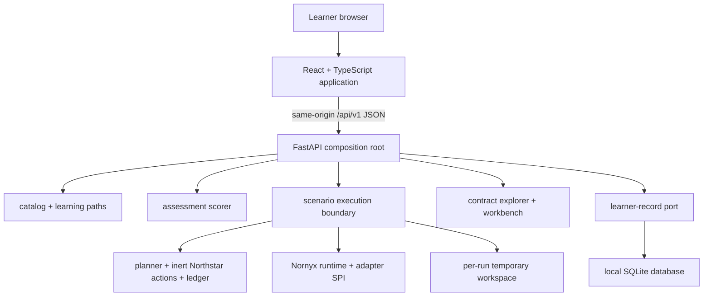

# Architecture

This document describes the implemented system. The decision rationale is in
[ADR 0001](adr/0001-gui-first-academy-architecture.md).

## System context

Nornyx Academy is a local-first single-user web application. It governs only its inert training
targets; using Nornyx inside the academy does not by itself govern the academy platform.

## Repository topology

| Area | Responsibility |
|---|---|
| `frontend/src` | Learner navigation, controls, diagrams, structured rendering, assessment, progress |
| `frontend/e2e` | Fresh-learner browser and accessibility journey |
| `src/nornyx_lab/academy/schemas.py` | Versioned API contracts and public vocabulary |
| `academy/catalog.py` + `academy/content` | Modules, paths, enrichment, assessments, compatibility record |
| `academy/scenarios.py` | Five-minute A/B run against one captured plan and real Nornyx decision/evidence APIs |
| `academy/foundations.py` | Six deterministic, browser-safe AI/software foundation interactions |
| `academy/structured.py` | Isolated migration adapter for the original lab implementations |
| `academy/contracts.py` | Real `.nyx` explorer, graph projection, guided mutation, parse/check/generate preview |
| `academy/capstone.py` | Configurable multi-identity workflow, failure injection, evidence, and bounded claim |
| `academy/assessments.py` | Data-driven learner scoring; never repository pytest |
| `academy/progress.py` | Replaceable repository protocol and SQLite implementation |
| `academy/settings.py` | Process-memory-only optional live-model secret boundary |
| `academy/app.py` | FastAPI composition, progress orchestration, security headers, production static serving |
| `labs`, `contracts`, `src/nornyx_lab` | Preserved verified training domain and regression assets |

## API boundary

All learner operations use `/api/v1`. Pydantic models reject unexpected request fields and make
ambiguous states explicit.

| Area | Operations |
|---|---|
| Platform | health, installed/audited versions and assurance ceiling |
| Curriculum | catalog, module detail, all-module execution |
| Demonstration | governed/ungoverned A/B with controlled variables |
| Assessment | public question without answer leakage; scored submission |
| Progress | dashboard, reset, export |
| Contracts | summaries, source/canonical/graph/control detail, isolated workbench validation |
| Settings | inspect or change process-local live-model configuration |
| Capstone | definition and configured execution |

The browser never infers an outcome from prose. Scenario responses distinguish planner input,
proposals, authorization decisions, enforcement, attempts, completions, evidence findings, and
claims. Unknown evidence is represented as unknown; it is not converted to zero.

## Scenario execution

### Five-minute path

1. Capture one deterministic or explicitly live plan.
2. Execute its actions through an ungoverned inert path.
3. Execute the same captured actions through the named Nornyx-backed enforcement path.
4. Record business attempts/completions separately from Nornyx evidence occurrences.
5. Validate supplied evidence and construct bounded claim interpretations.
6. Return both variants and per-action comparisons.
7. Restore all in-memory scenario state before returning.

The real approval-controlled path is a gated `ZoneCrossingRequest` with an optional
`ApprovalAssertion`. A generic capability evaluation does not accept approval and is never
described as becoming authorized because a separate approval assertion was validated.

### Original labs

`run_structured_lab` creates a temporary workspace, copies only the lab/contract/script fixtures,
sets a context-local repository root, imports the copied lab, and renders context calls into
typed content blocks. Manual terminal instructions are hidden and flagged. Results and paths are
sanitized before serialization. The temporary directory is removed in `finally`.

Framework absence produces `unavailable` plus a diagnostic. It never returns completion and
never swaps in a semantically different fake run.

### Foundations and capstone

New scenarios operate in memory. Variability lessons use seeded sampling and label it as a
simulation. Business actions call only inert Northstar functions. The capstone’s identities,
capabilities, handoffs, approval paths, failure modes, evidence, bypasses, and residual risk are
returned as structured blocks and results.

## Persistence

`LearnerRecordRepository` is the boundary consumed by the application. The initial
`SQLiteLearnerRecordRepository` stores:

- execution count and whether any execution passed;
- assessment history, answers, scores, feedback, and version binding;
- best score and whether any assessment passed;
- concepts mastered and needing review;
- last activity;
- local learner id.

A module becomes complete only after a successful execution and a passed assessment. The
export is a local completion report, not a credential, certification, or independent
attestation. No model secret enters the database.

## Frontend information architecture

The application provides home/orientation, demonstration, paths, curriculum, dashboard, lesson
viewer, contract explorer, guided builder, agent/trust-zone graph, approval simulator, evidence
explorer, diagnostics, capstone, settings, and boundaries pages. Dense material uses progressive
disclosure; status is conveyed by text and shape as well as color. The shell supports skip links,
visible focus, semantic headings, keyboard controls, desktop/tablet layouts, and readable mobile
fallbacks.

## Deployment

The production image is a multi-stage build:

1. pinned Node builds the Vite application with `npm ci`;
2. pinned uv synchronizes the frozen Python lock into a pinned Python base;
3. the runtime executes as a non-root user and serves UI/API from Uvicorn;
4. Compose uses a read-only root filesystem, drops capabilities, mounts progress separately,
   and supplies an isolated temporary filesystem.

The application is deliberately same-origin. No CORS wildcard is required. API responses use
`no-store`, CSP, frame denial, MIME sniffing protection, referrer suppression, and a restricted
permissions policy.

## Extension points

- replace SQLite by implementing `LearnerRecordRepository`;
- add modules through authored content, one executable scenario, and one assessment;
- add scenario controls by extending versioned request models rather than accepting shell text;
- add a framework only with an explicit adapter surface, conformance result, availability state,
  and coverage limitation;
- upgrade Nornyx only through the compatibility gate in
  [NORNYX_COMPATIBILITY.md](NORNYX_COMPATIBILITY.md).

## Failure behavior

- invalid API shape: HTTP 422 with structured validation detail;
- unknown module/assessment/contract: HTTP 404;
- live model unconfigured or unavailable: HTTP 503, no deterministic fallback;
- optional framework absent: typed `unavailable`, no completion;
- Nornyx semantic invalidity: diagnostics with semantic paths;
- lock drift: separate lock failure even when source remains semantically valid;
- missing evidence: indeterminate or unsupported claim, never inferred prevention;
- execution exception: no completion; isolated workspace removed.
